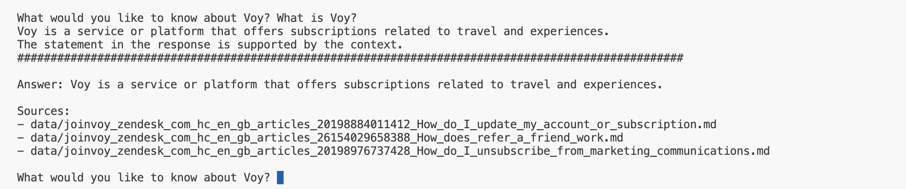
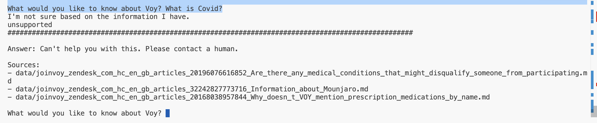

# Voy FAQ Bot

A Retrieval-Augmented Generation (RAG) system for Voy's help center, built using LangChain, LanceDB, and OpenAI's GPT models.

## Example Outputs

### When the system knows the answer


*The RAG system provides a confident, supported answer with sources.*

### When the system does not know the answer


*The RAG system declines to answer questions that can't be answered using the knowledge base (vector store) and suggests contacting a human.*

### Sample hallucination and consistency evaluation result

```json
{
  "hallucination_metrics": {
    "hallucination_rate": 0.6666666666666666,
    "samples": [
      {
        "query": "What are the symptoms of COVID-19?",
        "context": "## How to Get Started\n\nTo begin your journey with Voy:\n\n1. Visit our [website](http://www.joinvoy.com/)\n2. Click on \"Am I Eligible\"\n3. Complete our medical questionnaire\n\nThis first step helps our Clinical Team understand your needs and check if our treatment is the right fit for you.\n\nRelated to\n\n- [General Query](https://joinvoy.zendesk.com/hc/en-gb/search?content_tags=01GVFXVMYVQJHA7JPF273TBAFJ&utf8=%E2%9C%93 \"Search results\")\n\n## Related articles\n\n## Related articles\n\n- [Are there any medical conditions that might disqualify someone from participating?](https://joinvoy.zendesk.com/hc/en-gb/related/click?data=BAh7CjobZGVzdGluYXRpb25fYXJ0aWNsZV9pZGwrCJT8%2BENeEjoYcmVmZXJyZXJfYXJ0aWNsZV9pZGwrCJQQDdI%2FEjoLbG9jYWxlSSIKZW4tZ2IGOgZFVDoIdXJsSSJ4L2hjL2VuLWdiL2FydGljbGVzLzIwMTk2MDc2NjE2ODUyLUFyZS10aGVyZS1hbnktbWVkaWNhbC1jb25kaXRpb25zLXRoYXQtbWlnaHQtZGlzcXVhbGlmeS1zb21lb25lLWZyb20tcGFydGljaXBhdGluZwY7CFQ6CXJhbmtpCA%3D%3D--b328b36f81e10a266527eaad3d7f6eb13d5de34e)\n- [Can I restart my susbcription at a higher dosage?](https://joinvoy.zendesk.com/hc/en-gb/related/click?data=BAh7CjobZGVzdGluYXRpb25fYXJ0aWNsZV9pZGwrCBQudbR6FToYcmVmZXJyZXJfYXJ0aWNsZV9pZGwrCJQQDdI%2FEjoLbG9jYWxlSSIKZW4tZ2IGOgZFVDoIdXJsSSJXL2hjL2VuLWdiL2FydGljbGVzLzIzNjE2NzU3NzcxNzk2LUNhbi1JLXJlc3RhcnQtbXktc3VzYmNyaXB0aW9uLWF0LWEtaGlnaGVyLWRvc2FnZQY7CFQ6CXJhbmtpCQ%3D%3D--ec225d19b0dbbeb66a043d213fb52ddff6f75933)",
        "response": "The symptoms of COVID-19 can range from mild to severe and may appear 2-14 days after exposure to the virus. They include:\n\n- Fever or chills\n- Cough\n- Shortness of breath or difficulty breathing\n- Fatigue\n- Muscle or body aches\n- Headache\n- New loss of taste or smell\n- Sore throat\n- Congestion or runny nose\n- Nausea or vomiting\n- Diarrhea\n\nPlease note that this list does not include all possible symptoms. If you feel unwell or suspect you may have been exposed to the virus, it is important to seek medical attention immediately.",
        "verification": "The entire response is unsupported by the context. The context is about how to get started with a service called Voy, while the response is about symptoms of COVID-19."
      },
      {
        "query": "What medications should be avoided during weight loss?",
        "context": "[Skip to main content](https://joinvoy.zendesk.com/hc/en-gb/articles/20167996852628-Is-this-a-safe-and-effective-way-to-manage-weight-loss#main-content)\n\nAbsolutely! GLP-1 medications, when used alongside our expert coaching, have consistently demonstrated impressive results in helping individuals reach their goals. Within the initial six months of treatment, people have achieved weight loss of up to 10%.\n\nMoreover, you can rest assured that your journey towards better health is not just effective but also safe. These medications, when prescribed and monitored by our medical experts, are generally well-tolerated.\n\nOur medical team is committed to guiding and overseeing your treatment to ensure your safety and success. So, you're not alone on this path to achieving your goals.\n\n## Related articles\n\n- [Is this a safe and effective way to manage weight loss?](https://joinvoy.zendesk.com/hc/en-gb/related/click?data=BAh7CjobZGVzdGluYXRpb25fYXJ0aWNsZV9pZGwrCJTJSbpXEjoYcmVmZXJyZXJfYXJ0aWNsZV9pZGwrCJT8%2BENeEjoLbG9jYWxlSSIKZW4tZ2IGOgZFVDoIdXJsSSJdL2hjL2VuLWdiL2FydGljbGVzLzIwMTY3OTk2ODUyNjI4LUlzLXRoaXMtYS1zYWZlLWFuZC1lZmZlY3RpdmUtd2F5LXRvLW1hbmFnZS13ZWlnaHQtbG9zcwY7CFQ6CXJhbmtpCg%3D%3D--2a75c7e13f3885388cd0e85c9e593f2913ecb8f6)\n\n[Skip to main content](https://joinvoy.zendesk.com/hc/en-gb/articles/20168038957844-Why-doesn-t-VOY-mention-prescription-medications-by-name#main-content)\n\nAt Voy, we're committed to providing you with the most appropriate and effective treatment for your weight loss journey. Here's why we don't mention specific prescription medications upfront:\n\n## The right treatment plan for you\n\nWe believe choosing the right treatment should always be made with your clinician once they know more about your circumstances. This allows us to:\n\n- Ensures you receive the most suitable medication for your needs\n- Run a thorough assessment of your health history\n- Provides an opportunity to discuss potential benefits and risks\n\n## UK Advertising Regulations\n\n- Advertising restrictions in the UK prevent us from presenting all of our treatment options until you've had a clinical consultation.\n- This ensures that you receive personalised advice based on your individual health profile.\n\n## How to Get Started",
        "response": "The text does not provide information on what medications should be avoided during weight loss.",
        "verification": "The claim that the text provides information on what medications should be avoided during weight loss is unsupported. The context does not mention any medications that should be avoided during weight loss."
      }
    ]
  },
  "consistency_metrics": {
    "average_consistency": 1.0,
    "per_query_results": [
      {
        "original_query": "What are the symptoms of COVID-19?",
        "variations": [
          "Can you list the signs of COVID-19?",
          "What signs indicate a COVID-19 infection?",
          "What are the indications of having COVID-19?"
        ],
        "consistency_score": 1.0
      },
      {
        "original_query": "What is Voy?",
        "variations": [
          "Can you explain what Voy is?",
          "Could you tell me about Voy?",
          "What does Voy refer to?"
        ],
        "consistency_score": 1.0
      },
      {
        "original_query": "What medications should be avoided during weight loss?",
        "variations": [
          "Which drugs should not be taken while trying to lose weight?",
          "What are the medications to avoid when trying to shed pounds?",
          "During weight loss, what medications should one steer clear of?"
        ],
        "consistency_score": 1.0
      }
    ]
  }
}
```

## Project Structure

The project consists of four main components:

1. **Data Collection** (`crawl_voy_zendesk.py`)
2. **Vector Store Creation** (`create_vector_store.py`)
3. **RAG Pipeline with Self-Reflection** (`self_reflective_rag.py`)
4. **Evaluation System** (`evaluator.py`)

## Components

### 1. Data Collection (`crawl_voy_zendesk.py`)

This script crawls Voy's Zendesk help center to collect FAQ content.

**Key Features:**
- Uses Firecrawl to extract content from Zendesk
- Saves content in markdown format.   
Note: The file didn't successfully run so I had to use the firecrawl UI to crawl 30 pages from voy.

**Design Decisions:**
- Structured storage in `data/` directory
- I have prioritised tools that allow me to experiment fast or are open source. Hence, I have used LanceDB as vector store and OpenAI for LLM.
- I have put more focus in evaulation than any other stuff.

### 2. Vector Store Creation (`create_vector_store.py`)

Creates a vector store from the crawled content using LanceDB and OpenAI embeddings.

**Key Features:**
- Implements document chunking(1000 chars) with overlap (200). Didn't think much about it. 
- Stores vectors in LanceDB for efficient retrieval

**Design Decisions:**
- Chunk size of 1000 characters with 200 character overlap
- LanceDB chosen for its efficient vector storage and retrieval
- OpenAI embeddings for high-quality semantic search

### 3. RAG Pipeline with Self-Reflection (`self_reflective_rag.py`)

Implements a RAG system with self-reflection to ensure accurate responses.

**Key Features:**
- Uses GPT-3.5 Turbo for response generation
- Implements self-reflection for hallucination detection
- Provides source attribution for answers

**Design Decisions:**
- Three-step verification process:
  1. Initial response generation
  2. [Self-reflection verification](https://www.semanticscholar.org/paper/A-Self-Reflective-Retrieval-Augmented-Generation-to-Hu-Washburn/1281ec0c63825715cd666c447662bbf7f6992fc3) - Eliminates hallucinations
  3. Response revision if needed  (Currently the relevancy of the documents is only determined using the title of the document, this can be improved and will boost the performance)
- Temperature set to 0 for consistent responses
- Retrieves top 3 most relevant documents for context (again, this can be improved)

### 4. Evaluation System (`evaluator.py`)

Evaluates the RAG system's performance across multiple dimensions.

**Key Features:**
- Hallucination detection
- Consistency evaluation
- Semantic similarity measurement

**Design Decisions:**
- Uses GPT-4 for evaluation (chose a better model than gpt-3.5-turbo as a judge)
- Implements comprehensive metrics:
  - Hallucination rate
  - Consistency across variations
  - Semantic similarity scoring

## Usage

1. **Setup Environment:**
```bash
pip install -r requirements.txt
```

2. **Set Environment Variables:**
```bash
export OPENAI_API_KEY=your_api_key_here
```
or, create a .env file with credentials. 

3. **Run the Pipeline:**
```bash
# 1. Crawl Zendesk
python crawl_voy_zendesk.py DO NOT TRY

# 2. Create Vector Store
python create_vector_store.py

# 3. Start RAG System
python self_reflective_rag.py

# 4. Run Evaluation (optional)
python evaluator.py
```

## Design Decisions

### 1. Model Selection
- **GPT-3.5 Turbo** for response generation (cost-effective, good performance)
- **GPT-4** for evaluation (better analysis capabilities)

### 2. Vector Store
- **LanceDB** chosen for:
  - Efficient vector storage
  - Fast similarity search
  - Local storage capability
  - Easy integration with LangChain

### 3. Document Processing
- **Chunking Strategy:**
  - 1000 character chunks
  - 200 character overlap
  - Preserves context across chunks

### 4. Self-Reflection
- **Three-Step Verification:**
  1. Initial response generation
  2. Context verification
  3. Response revision if needed
- **Prompt Engineering:**
  - Clear instructions for verification
  - Structured output format
  - Explicit handling of uncertainty

### 5. Evaluation Metrics
- **Comprehensive Assessment:**
  - Hallucination detection
  - Consistency across variations
  - Source attribution

## Future Improvements
Let's discuss in the next call.